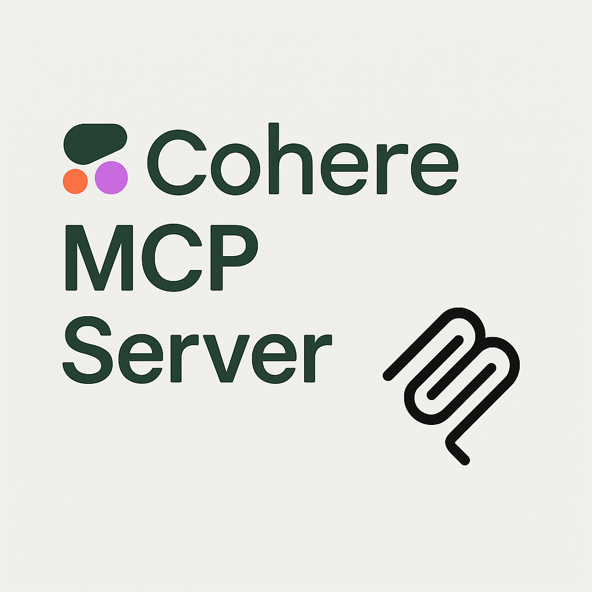

# Cohere MCP Server

A Model Context Protocol (MCP) server implementation that integrates with [Cohere](https://cohere.com) API to bring cutting-edge multilingual models and advanced retrieval capabilities to your applications.

